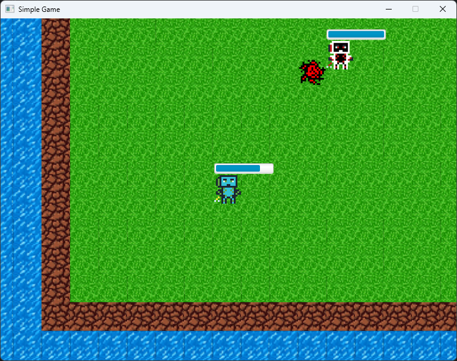

# Game2.0
*Gioco della [Repository](https://github.com/GHManu/Game) (tipologia: RPG action adventure), riscritto con le regole del corso di Ingegneria Del Software; ovviamente non è completo, ma ho cercato di farlo con quello che c'era*; Per Dettagli tecnici, analisi dei requsiti, ecc... leggere il pdf scritto in LaTeX con il compilatore online *TeXPage* -> *Specifica_Requisiti_Software.pdf* , lascio anche il progetto di LaTeX con tutti gli script e alcuni diagrammi sono fatti con la libreria tikzuml mentre altri, di cui lascio lo script, in *PlantUML*. 

# Anteprima

